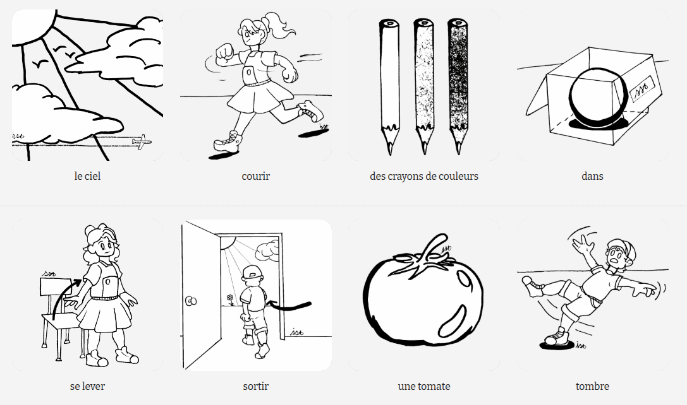

# MAEL Phrases

*Une application appartenant au [__projet MAEL__](https://github.com/Yobeco/MAEL_Project)*   
Copyright (c) 2023 Yonnel Bécognée

   

 

## :fr: Français | :es: [Español](https://github.com/Yobeco/MAEL_Phonofouille/blob/main/README.es.md)  | :gb: [English](https://github.com/Yobeco/MAEL_Phonofouille/blob/main/README.md)

## A- Description :eye:

**MAEL Phrases** est une **application WEB** :globe_with_meridians: qui permet à l'élève de créer des phrases dans la langue qu'il est en train d'apprendre, en toute autonomie.   
Son interface est conçue pour être utilisée par un enfant, dés 6 ans :baby:.   

**MAEL Phrases** permet aux élèves ne possédant aucun "parlant" chez lui d'écouter et même de formuler des phrases dans la langue étudiée dans un contexte pédagogique élaboré par son professeur. Elle permet donc au professeur de **booster son enseignement d'une langue** :100:

**Potentiellement 55 langues sont implémentables !** :astonished:

:fr: :gb: :es: :portugal: :brazil: :it: :de: :ru: :jp: :cn: :kr: ...

---

## B- Fonctionnalités :clipboard:

**MAEL Phrases** est en version alpha. Il s'agit d'une démonstration de ce qui sera le coeur d'une plateforme pédagogiques permettant à l'enseignant de créer et de suivre la progression des activités sur mesure qu'il a créé pour ses élèves.   
Les élèves se connectant pourront faire les activités en toute autonomie.

- **Choix de 5 langues** (en haut à droite) :fr: :gb: :es: :brazil: :cn:
- **Bibliothèque de test** répartie par nature des mots et par thèmes.
- **Ligne de dépôt** pour y mettre les images choisies
- **Bouton pour afficher la phrase correspondante**
- **Oralisation de la phrase** par une voix de synthèse (Préférez Chrome. Malheureusement, la voix de FireFox n'est pas à la hauteur...)

---

## C- Comment utiliser MAEL Phrases ? :blush:

:warning: Préférez Chrome . Malheureusement, la voix de FireFox  n'est pas à la hauteur...

---

1. **Glissez / déposez** des images provenant de la bibliothèque en suivant la logique d'une phrase
1. **Appuyeez sur le boutton "bouche"** pour oraliser votre phrase.

---

## D- Principe de fonctionnement :gear:

*(Pour aider à la compréhension du code)*

---

1. Un bibliothèque (très frugale) d'images est générée à partir de fichiers JSON   selon des catégories (Classes grammaticales ou thèmes). Il est prévu d'utiliser une basse de données PostgresSQL .
1. Quand ces mots sont déposé sur la ligne de dépôt, ils préparent une liste.
1. Quand on appuie sur le bouton "bouche" :lips:, la liste est envoyée à l'API d'une IA (Gemini 2.5  pour le moment)
1. Une prompte demandant de créer la phrase la plus logique avec ces mots est créée dans la langue qui a été choisie (français :fr: par défaut)
1. Quand la phrase été reçue par **MAEL Phrases**, elle est affichée à droite du bouton "bouche".
1. La même phrase est envoyée à la voix de synthèse :speaking_head: du navigateur.

**MAEL Phrase** Utilisera un [**back end en Kotlin**](https://github.com/Yobeco/MAEL_Backend)  (déjà commencé, mais à l'arrêt... :disappointed:) pour accéder à [sa base de données](https://github.com/Yobeco/MAEL_Phrases/blob/main/readme_assets/MAEL-Phrase%20-%20Description%20fonctionnelle%20-%20V2.pdf) en **PostgresSQL** .

---

## E- Fonctionnalités à développer :rocket:

### 1- Créer une plateforme qui permette au porfesseur de faire des comptes pour gérer ses classes et ses élèves avec :

- son propre hébergement,
- son propre Cloud  (pour héberger les fichier mp3 utilisés par **MAEl Gen** et **MAEl Scan**,
- sa propre AI  avec API,
- son propre service de voix de synthèse :speaking_head: avec API,
- son prore moteur de recherche de mots :mag_right: (inspiré de [Phonofouille](https://github.com/Yobeco/MAEL_Phonofouille)).

### 2- Créer une base de données PostgresSQL  (derrière un backend Kotlin ) pour :

- Gérer les comptes des professeurs et des élèves :bust_in_silhouette:.
- Gérer les bibliothèques de mots et d'images :books:.
- Gérer les activités créées

### 3- Permettre au professeur de gérer ses élèves et activités

- Créer des groupes d'élèves :busts_in_silhouette: (par classe, par besoins, par ateliers...),
- Utiliser les bibliothèques de mots proposées par défault,
- Créer ses propres bibliothèques de mots :bookmark_tabs:,
- Partager :left_right_arrow: ses bibliothèques de mots,
- Créer / partager ses propres activités,
- Proposer des activités aux élèves de manière différentiée :1234: selon les groupes d'élèves ou même de manière individuelle :compass:,
- Voir les productions et l'évolution de ses élèves :eyes:,
- Proposer de nouvelles activités en fonction des ces résultats :new: ...
- Former une nouvelle classe avec les comptes d'élèves déjà enregistrés l'année d'avant :scroll:.

### 4- Permettre à l'élève de pariciper

- Entrer de manière sécurisée sur la plateforme avec son compte :heavy_check_mark:,
- Faire les activités proposées par son professeur :computer:,
- Accéder une une zone d'activité libre :grinning: (bac à sable),
- Voir de manière graphique mais simple ses progrès :chart_with_upwards_trend:.

### 5- Créer une bibliothèque d'images

- Pour illustrer la [base de donnée Minilex](./readme_assets/Minima _Lexical_C1fev25.pdf) (Créée par AMLA Nord)
- Nous avons besoin d'illustrations de ce type : 
    - logeant dans un format carré,
    - avec fond détouré,
    - au trait noir simple (colorisable par la suite),
    - très évocatrice (faciles à comprendre pour les enfants),

### :+1: Proposez votre aide au développement de la plate forme MAEL ! :raised_hands:

---

## F- Participez au projet MAEL :open_hands:

:ring_buoy: Pour **obtenir de l'aide** concernant l'utilisation de MAEL ou pour **paticiper au développement** :computer:, écrivez-moi ici :

### :mailbox_with_mail: ***[mael@lvh.edu.ni](mailto:mael@lvh.edu.ni)***

### :star2: Contributeurs

:open_hands: Un grand merci à toutes les personnes qui vont contribuer à ce projet ! 

| Avatar | Nom                | GitHub                          | Rôle                     |
|--------|--------------------|---------------------------------|--------------------------|
|  | Bécognée Yonnel | [@Yobeco](https://github.com/Yobeco)   | Mainteneur                     |
|  | Padawan | [@Nail-yk](https://github.com/Nail-yk) | Traduction de la documentation |
| ... | ... | ... | Développeur |
| ... | ... | ... | Développeuse |
| ... | ... | ... | Illustrateur (trice) |

---

## G- Essayez MAEL Phrases en ligne

Il s'agit d'une [**version alpha** de démonstration](https://yobeco.github.io/MAEL/index.html) qui utilise l'API de Gemini 2.5  pour le moment.

:warning: Utilise Chrome  pour cette démo ! La voix de FireFox  est horrible... C'est dommage... :disappointed:

:warning: Ce n'est pas une version de production, faites des essais de manière modérée :raised_hand: afin de laisser tout le monde profiter des tokens disponibles.
